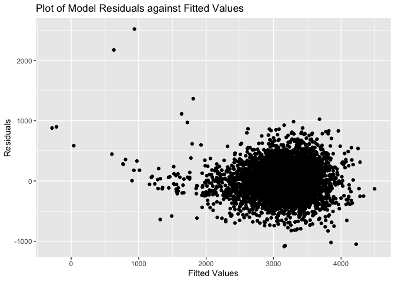
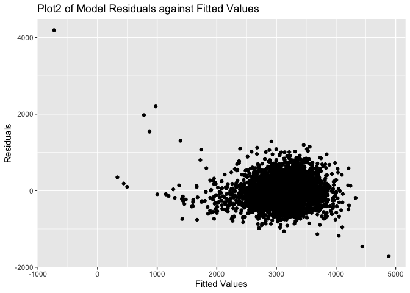
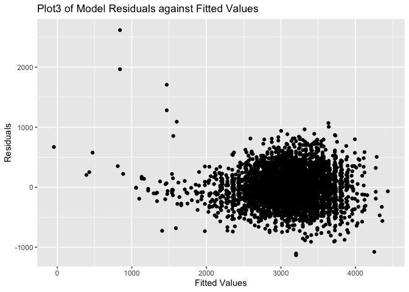
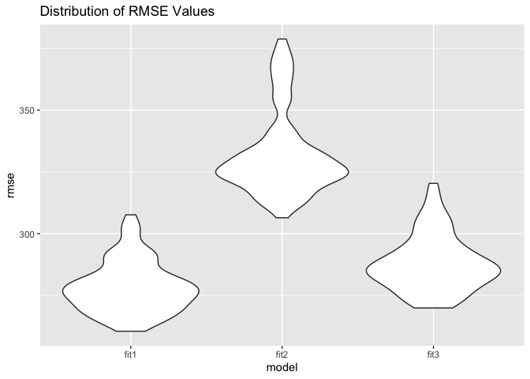

p8105_hw6_jf3355
================
Jiahao Fan
12/2/2021

``` r
library(tidyverse)
```

    ## ── Attaching packages ─────────────────────────────────────── tidyverse 1.3.1 ──

    ## ✓ ggplot2 3.3.5     ✓ purrr   0.3.4
    ## ✓ tibble  3.1.5     ✓ dplyr   1.0.7
    ## ✓ tidyr   1.1.4     ✓ stringr 1.4.0
    ## ✓ readr   2.0.2     ✓ forcats 0.5.1

    ## ── Conflicts ────────────────────────────────────────── tidyverse_conflicts() ──
    ## x dplyr::filter() masks stats::filter()
    ## x dplyr::lag()    masks stats::lag()

``` r
library(broom)
library(knitr)
library(modelr)
```

    ## 
    ## Attaching package: 'modelr'

    ## The following object is masked from 'package:broom':
    ## 
    ##     bootstrap

##Problem1 #Load and clean the data for regression analysis

``` r
birthweight =
  read.csv("birthweight.csv") %>% 
  skimr::skim() %>% 
  select(skim_variable, n_missing) %>%
  knitr::kable()
birthweight  
```

| skim_variable | n_missing |
|:--------------|----------:|
| babysex       |         0 |
| bhead         |         0 |
| blength       |         0 |
| bwt           |         0 |
| delwt         |         0 |
| fincome       |         0 |
| frace         |         0 |
| gaweeks       |         0 |
| malform       |         0 |
| menarche      |         0 |
| mheight       |         0 |
| momage        |         0 |
| mrace         |         0 |
| parity        |         0 |
| pnumlbw       |         0 |
| pnumsga       |         0 |
| ppbmi         |         0 |
| ppwt          |         0 |
| smoken        |         0 |
| wtgain        |         0 |

There is no missing value.

``` r
birthweight_df = 
  read.csv("birthweight.csv") %>% 
  mutate(
    babysex = recode_factor(babysex, "1" = "male", "2" = "female"),
    frace = recode_factor(frace, "1" = "White", "2" = "Black", "3" = "Asian", "4" = "Puerto Rican", "8" = "Other", "9" = "Unkown"),
    mrace = recode_factor(mrace, "1" = "White", "2" = "Black", "3" = "Asian", "4" = "Puerto Rican", "8" = "Other"),
    malform = recode_factor(malform, "0" = "absent", "1" = "present" )
  )
```

#Propose a regression model for birthweight We need first find proper
variable. after I run the linear regression with all variable, I choose
the variables’ p-value less than 0.05, which are `babysex`, `bhead`,
`blength`, `delwt`, `fincome`, `gaweeks`, `mheight`, `ppwt`, `smoken` .

``` r
fit1 = lm(bwt~ babysex + bhead + blength + delwt + fincome + gaweeks + mheight + ppwt + smoken, data =birthweight_df)
fit1 %>% 
  broom::tidy() %>% 
  select(term,estimate,p.value) %>% 
  knitr::kable()
```

| term          |     estimate |   p.value |
|:--------------|-------------:|----------:|
| (Intercept)   | -6585.710435 | 0.0000000 |
| babysexfemale |    30.547532 | 0.0004067 |
| bhead         |   134.793312 | 0.0000000 |
| blength       |    77.556796 | 0.0000000 |
| delwt         |     3.876276 | 0.0000000 |
| fincome       |     1.216271 | 0.0000000 |
| gaweeks       |    12.886298 | 0.0000000 |
| mheight       |     8.044414 | 0.0000071 |
| ppwt          |    -2.710520 | 0.0000000 |
| smoken        |    -2.694817 | 0.0000032 |

``` r
plot1 = 
  birthweight_df %>% 
  modelr::add_residuals(fit1) %>% 
  modelr::add_predictions(fit1) %>% 
  ggplot(aes(x = pred, y = resid))+ geom_point()+labs(title = "Plot of Model Residuals against Fitted Values", x = "Fitted Values",y = "Residuals")
plot1
```

<!-- -->
#Compare the model to two others. fit2: One using length at birth and
gestational age as predictors (main effects only) fit3: One using head
circumference, length, sex, and all interactions (including the
three-way interaction) between these

``` r
fit2 <- lm(bwt ~ blength + gaweeks, data = birthweight_df)
fit3 <- lm(bwt ~ bhead + blength + babysex + bhead*blength + bhead*babysex + blength*babysex + bhead*blength*babysex, data = birthweight_df)
plot2 = 
  birthweight_df %>% 
  modelr::add_residuals(fit2) %>% 
  modelr::add_predictions(fit2) %>% 
  ggplot(aes(x = pred, y = resid))+ geom_point()+labs(title = "Plot2 of Model Residuals against Fitted Values", x = "Fitted Values",y = "Residuals")

plot3 = 
  birthweight_df %>% 
  modelr::add_residuals(fit3) %>% 
  modelr::add_predictions(fit3) %>% 
  ggplot(aes(x = pred, y = resid))+ geom_point()+labs(title = "Plot3 of Model Residuals against Fitted Values", x = "Fitted Values",y = "Residuals")

plot2
```

<!-- -->

``` r
plot3
```

<!-- -->

#Make this comparison in terms of the cross-validated prediction error

``` r
cv_df = 
  crossv_mc(birthweight_df, 100) %>% 
  mutate(
    train = map(train, as_tibble),
    test = map(test, as_tibble)) %>% 
  mutate(
    fit1 = map(train, ~lm(bwt ~ babysex + bhead + blength + delwt + fincome + gaweeks + mheight + ppwt + smoken, data = .x)),
    fit2 = map(train, ~lm(bwt ~ blength + gaweeks, data = .x)),
    fit3 = map(train, ~lm(bwt ~ bhead + blength + babysex + bhead*blength + bhead*babysex + blength*babysex + bhead*blength*babysex, data = .x))
  ) %>% 
  mutate(
    rmse_fit1 = map2_dbl(fit1, test, ~rmse(model = .x, data = .y)),
    rmse_fit2 = map2_dbl(fit2, test, ~rmse(model = .x, data = .y)),
    rmse_fit3 = map2_dbl(fit3, test, ~rmse(model = .x, data = .y))
    )
cv_df %>% 
  select(starts_with("rmse")) %>% 
  pivot_longer(
    everything(),
    names_to = "model", 
    values_to = "rmse",
    names_prefix = "rmse_") %>% 
  mutate(model = fct_inorder(model)) %>% 
  ggplot(aes(x = model, y = rmse)) + geom_violin() + labs( title = "Distribution of RMSE Values")
```

<!-- -->
From three plot, we can see fit1 has smallest rmse compare to others.
Thus, fit1 is the best model to fit.

##Problem2

``` r
weather_df = 
  rnoaa::meteo_pull_monitors(
    c("USW00094728"),
    var = c("PRCP", "TMIN", "TMAX"), 
    date_min = "2017-01-01",
    date_max = "2017-12-31") %>%
  mutate(
    name = recode(id, USW00094728 = "CentralPark_NY"),
    tmin = tmin / 10,
    tmax = tmax / 10) %>%
  select(name, id, everything())
```

    ## Registered S3 method overwritten by 'hoardr':
    ##   method           from
    ##   print.cache_info httr

    ## using cached file: ~/Library/Caches/R/noaa_ghcnd/USW00094728.dly

    ## date created (size, mb): 2021-12-03 22:27:01 (7.616)

    ## file min/max dates: 1869-01-01 / 2021-12-31
